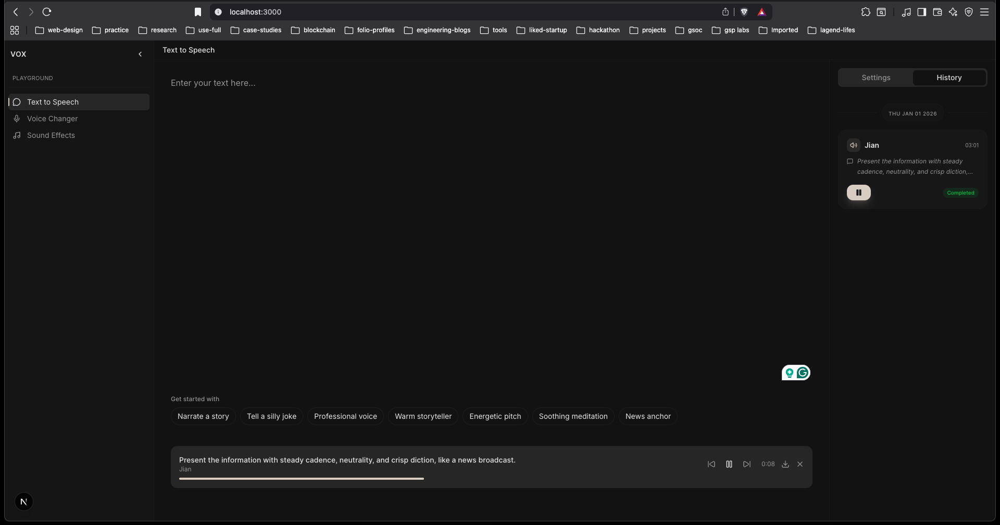

<div align="center">

# VOX

**An open-source, sophisticated multi-model AI audio generation platform**

[](https://nextjs.org)
[](https://www.typescriptlang.org/)
[](https://nx.dev)
[](https://opensource.org/licenses/MIT)

<br />



<br />

[](https://youtu.be/g6lG5zhfPN8?si=vv6WTaPdieRBF45P)

<br />

_Integrating state-of-the-art voice conversion, SFX generation, and text-to-audio models into a seamless, high-fidelity experience._

</div>

---

## Overview

VOX is a modular open-source AI audio platform that brings together state-of-the-art models for:

- **Voice conversion & cloning**
- **Multilingual text-to-speech**
- **Text-to-audio & sound effects generation**

## Quick Start

One command sets up everything — environments, model weights, dependencies, and database:

```bash
chmod +x init.sh
./init.sh
```

## Tech Stack

### **Frontend**

- **Next.js 15** (App Router)
- **TypeScript**
- **Tailwind CSS**
- **Zustand**
- **Tanstack Query**

### **Backend**

- **Node.js 20+**
- **Drizzle ORM**
- **p-queue**

### **AI Models**

- **Seed-VC** — Zero-shot voice conversion & cloning
- **Make-An-Audio** — Text-to-audio generation
- **XTTS-v2** — High-quality multilingual TTS

### **Automation**

- **Bash orchestration**
- **Python-based** environment & model manager

## Project Structure

```text
├── packages/
│   ├── app/          # Next.js frontend
│   └── server/       # Backend API & database
├── models/
│   ├── seed-vc/      # Voice conversion
│   ├── make-an-audio/# Audio generation
│   └── xtts-v2/      # Text-to-speech
├── data/             # Audio assets & outputs
└── init.sh           # One-command setup
```

## System Requirements

- **OS**: macOS (MPS) or Linux (CUDA)
- **Python**: 3.10+
- **Node.js**: 20+
- **GPU**: Recommended (CPU supported with reduced performance)

## License

MIT — free to use, modify, and distribute.
